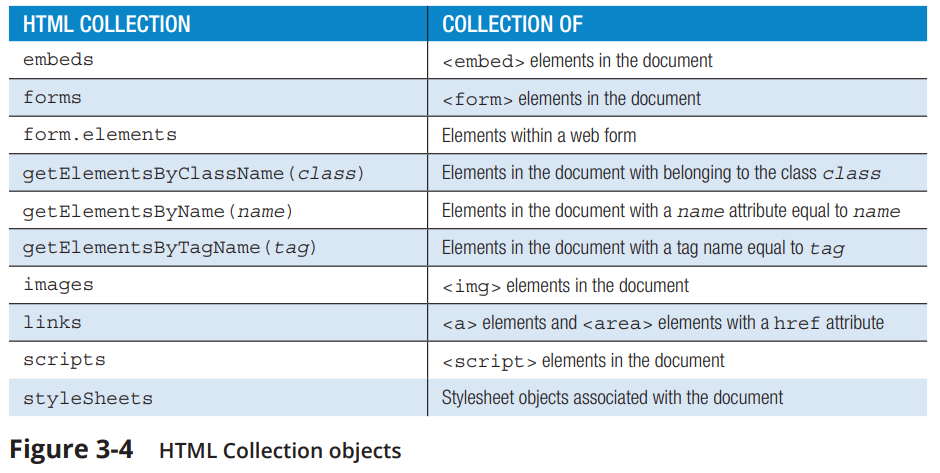
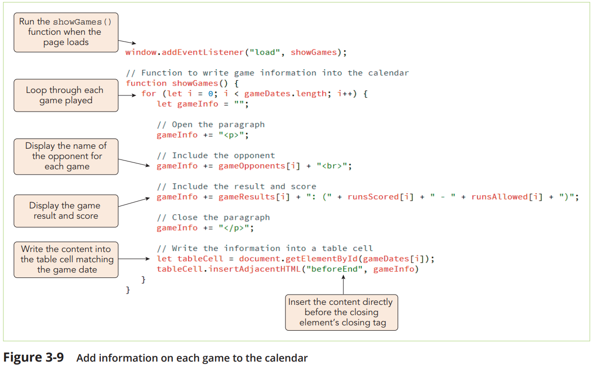
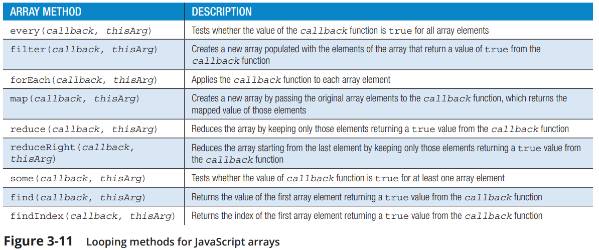

# Chapter 3 Building Arrays and Controlling Flow

## Storing Data in Arrays

### Declaring and Initializing Arrays

The most common way to create an array is with an array literal, a single statement that declares a variable and specifies array values as its content. The syntax of the array literal is:

```javascript
 let array = [values];
```

For example:

```javascript
let months = ["Jan", "Feb", "Mar", "Apr", "May", "Jun", "Jul", "Aug", "Sep", "Oct", "Nov", "Dec"];
```

Values stored within an array can involve several different data types. The following dataValues array stores a text string, a numeric value, a Boolean value, and the null value:

```javascript
let dataValues = ["April", 3, true, null];
```

You can initialize an array with no data values by leaving the contents within the brackets empty as the following statement demonstrates:

```javascript
let dataValues = [];
```

Arrays are objects, so another way to declare and initialize an array is with the following new Array() object constructor:

```javascript
let array = new Array(values)


let months = new Array("Jan", "Feb", "Mar", "Apr", "May", "Jun", "Jul", "Aug","Sep", "Oct", "Nov", "Dec");
```

### Elements and Indexes

Each value stored in an array is called an **element**, and each element is identified by its position or **index** within the array. Indexes always start with the number 0, so the first element in any array has an index of 0, the second has an index of 1, and so forth. You can set a specific array value by its index using the expression:

```javascript
array[index] = value;

monthName[0] = "January";
monthName[1] = "February";
monthName[2] = "March";
```

JavaScript also allows for the creation of **sparse** arrays in which some array values are left undefined so that the length of the array is greater than the number of defined values.

```javascript
let x = new Array();
x[0] = "Aaron";
x[99] = "Zukov";
```

The above commands create a sparse array with only two defined values out of 100 elements.

To determine an array’s current size, use the property:

```javascript
array.length
```

were `array` is a reference to the variable storing the array.

## Exploring HTML Collections

The Document Object Model organizes HTML elements into collections where each element is an **HTML Collection Object**.



### Referencing an Element within a Collection

To reference a specific element within an HTML collection, use either of the following expressions:

```javascript
objects[idref]
```

or

```javascript
objects.idref 
```

Thus, if the first inline image within a document has the tag

```html

```

it can be referenced with any of the following expressions:

```javascript
document.images[0]
document.images["TiptonLogo"]
document.images.TiptonLogo
```

As with JavaScript arrays, you can determine the number of elements within a collection with the length property. The following expression will return the number of images within the entire document:

```javascript
document.images.length
```

> :memo: **Nota:** The ordering of the elements within an HTML collection reflects the order of the element tags within the HTML file.

### Searching through the DOM

HTML collections can also be formed by searching through elements within the Document Object Model based on their **class attribute**, **tag name**, or **name attribute** using the following methods:

```javascript
document.getElementsByClassName(class)
document.getElementsByTagName(tag)
document.getElementsByName(name)
```

For example, to reference the first h1 element within the document, apply the following expression:

```javascript
document.getElementsByTagName("h1")[0]
```

To reference the second element in the document belonging to the "sideBar" class, use the expression:

```javascript
document.getElementsByClassName("sideBar")[1]
```

And to reference the third element in the document whose name attribute equals "menuChoice", use

```javascript
document.getElementsByName("menuChoice")[2]
```

You can also return HTML collections within a specified part of the document by nesting the object references in the following format:

```javascript
object.objects
```

where object is an element that contains other elements and objects is a collection within that container. Thus, the following expression returns the collection of paragraphs nested within the first table cell element of the web page:

```javascript
document.getElementsByTagName("td")[0].getElementsByTagName("p")
```

> **Common Mistakes**:
>> ***Working with Arrays and Indices***
Assuming that the first element in an array or an HTML collection has an index number of 1 rather than 0 is a common programming error for beginners. If you are working with an array collection and are seeing results offset by 1 from what you expect, check that your code accounts for 0 as the first index number.  
***Another common mistake is to omit the index number*** when using properties that should be applied to a specific element within a collection. For example, the expression:
`document.getElementsByTagName("input").checked` will result in an error because it attempts to apply the checked status to a collection of input elements. Instead, you must specify only a single element from the collection, as in the following expression that applies the checked status to the first input element:  
`document.getElementsTagName("input")[0].checked`

## Working with Program Loops

### The while Loop

In a while loop, a command block is executed while a given condition is true but stops once that condition is no longer true. The syntax of a while loop is:

```javascript
while (condition) {
 statements;
}
```

Each repetition of the command block is called an ***iteration***.

The `while loop` is an example of a ***pretest*** loop in that the condition is evaluated before each iteration of the command block.

### The do while Loop

```javascript
do {
 statements;
} while (condition);
```

The `do while loop`, is a ***posttest*** loop in which the condition is evaluated after the command block has been executed at least once.

### The for Loop

Another ***pretest*** loop is the `for loop`, in which the initial condition, stopping condition, and iterative expression are placed within a single line of code. The syntax of the for loop is:

```javascript
for (initial; condition; iteration) {
 statements;
}
```

To create a for loop that iterates through the contents of an array or HTML collection, apply the following general structure:

```javascript
for (let i = 0; i < objects.length; i++) {
 statements;
}
```

***insertAdjacentHTML() method***  
> to insert additional content into an element:

```javascript
element.insertAdjacentHTML(position, text)
```

> where `element` is the element into which the new content is inserted, `position` is the location of the new content, and `text` is the text of the content.  
>> The position argument has the following values:  
❯❯"beforeBegin"—to insert new content directly before the element’s opening tag  
❯❯"afterBegin"—to insert new content directly after the element’s opening tag  
❯❯"beforeEnd"—to insert new content directly before the element’s closing tag  
❯❯"afterEnd"—to insert new content directly after the element’s closing tag  



### Exploring Array Methods for Generating Loops

These methods are built into the language, they are usually faster than program loops and will make your code simpler and more compact. Each of these methods employs a ***callback function***, *which is a function passed as a parameter to another function or method*.

#### forEach() method

```javascript
arrayName.forEach(callback, thisArg)
```

The callback function has the syntax:

```javascript
function callback(arrValue, index, array) {
 statements;
}
```

where arrValue is the value of the current array element during each iteration within the array, index is the index of the current array element, and array is the name of the array (*arrayName*). Only the arrValue parameter is required; the other two are optional.

The following code uses the forEach() method to apply the writeValue() function to each element within the x array:

```javascript
let x = [1, 3, 5, 10];
x.forEach(writeValue); 

function writeValue(arrValue) {
 document.write("<td>" + arrValue + "</td> ");
}
```

#### Modify Array Elements

1. Start with a numeric array.

2. Use the forEach() method to modify each element.

```javascript
const numbers = [1, 2, 3];

numbers.forEach((value, index, arr) => {
    arr[index] = value * 10;
});

console.log(numbers);
```

Here, each number in the array numbers is multiplied by 10. The forEach() method provides access not just to the array element and its index, but also to the array itself, allowing direct modification.

3. Another example

    The forEach() method can also be used to change array values. The following code calls the stepUp5() function to increase the value of each item in the x array by 5:

```javascript
let x = [1, 3, 5, 10];
x.forEach(stepUp5);
function stepUp5(arrValue, i, arr) {
 arr[i] = arrValue + 5;
}

In this example, the stepUp5() function has three parameters: the `arrValue` parameter representing the value of the array element at each iteration, `i` representing the index number at each iteration, and `arr` representing the name of the array. The result is that value of the x array will be changed from [1, 3, 5, 10] to [6, 8, 10, 15].
```

Figure 3-11 describes some of the other array methods that can be used in place of a program loop. However, ***note that none of these methods can be applied to HTML collections, which, though they often act like arrays, are not arrays.***



## Adding Decision Making to Your Code

### The `if` Statement

The syntax of the if statement is:

```javascript
if (condition) {
 statements
}
```

### The `if else` Statement

```javascript
if (condition) {
 statements if condition is true
} else {
 statements if condition is not true
}


if (day === "Friday") {
 window.alert("Get ready for the Weekend!");
} else {
 window.alert("Have a great day!");
}
```

The else command block runs if the condition has any falsy value. Thus, a condition that evaluates to false or null or undefined will trigger the else command block.

### The `else if` Statements

```javascript
if (condition1) {
    statements if condition1 is true
} else if (condition2) {
    statements if condition2 is true
} else {
    statements if neither condition1 nor condition2 are true
}


if (day === "Friday") {
    window.alert("Get ready for the Weekend!");
} else if (day === "Monday") {
    window.alert("Start of another work week.");
} else {
    window.alert("Have a great day!");
}
```

### Nested `if` and `if else` Statements

```javascript
if (day === "Friday") {
    if (time === "8am") {
        window.alert("Start of the last day of the week.");
    } else if (time === "5pm") {
        window.alert("Time to start the weekend!");
    } else {
        window.alert("A few more hours until the weekend.");
    }
} else if (day === "Monday") {
    window.alert("Start of another work week.");
} else {
 window.alert("Have a great day!");
}
```

## Conditional Statements

### The `switch` Statement

```javascript
switch (expression) {
 case label1 : statements; break;
 case label2 : statements; break;
 case label3 : statements; break;
…
 default: statements; break;
}


switch (day) {
 case "Friday": alert("Thank goodness it's Friday!"); break;
 case "Monday": alert("Blue Monday"); break;
 case "Saturday": alert("Sleep in today."); break;
 default: alert("Today is " + day);
}
```

where `expression` is a statement that returns a value, label1, label2, label3, and so on are possible values of that expression, `statements` are the commands run with each possible value, and the final `default` option is run if none of the listed labels match the expression’s value.

The **break statement**, marking the end of each case, is an optional keyword that halts the execution of the switch
statement once a matching case has been found. For programs in which more than one label might match the expression, omit the break statements and the JavaScript interpreter will continue moving through the case labels, running all statements in which a match has been found. This situation is known as ***fallthrough***.

## Managing Program Loops and Conditional Statements

### The break Statement

The **`break`** statement can be used anywhere within any program loop or conditional statement. When a break statement is encountered, the execution of the code passes to the next set of statements. Breaks are most often used to exit a program loop before the stopping condition is met, as in the following program loop that examines the customerID
array for a specific customer ID number:

```javascript
for (let i = 0; i< customerID.length; i++) {
    if (customerID[i] === "C-14281") {
        window.alert("C-14281 is found");
        break; // stop processing the for loop
    }
}
```

### The continue Statement

The `continue` statement is like the break statement except that instead of stopping a program loop altogether, the continue statement stops only the current iteration and continues on to the next iteration. A continue statement is useful in programs that need to avoid undefined values that can cause the program to fail.

```javascript
for (let i = 0; i< customerEmail.length; i++) {
    if (customerEmail[i] === undefined) {
        continue;
    } else {
        // statements to process the e-mail address
    }
}
```


```javascript

```
