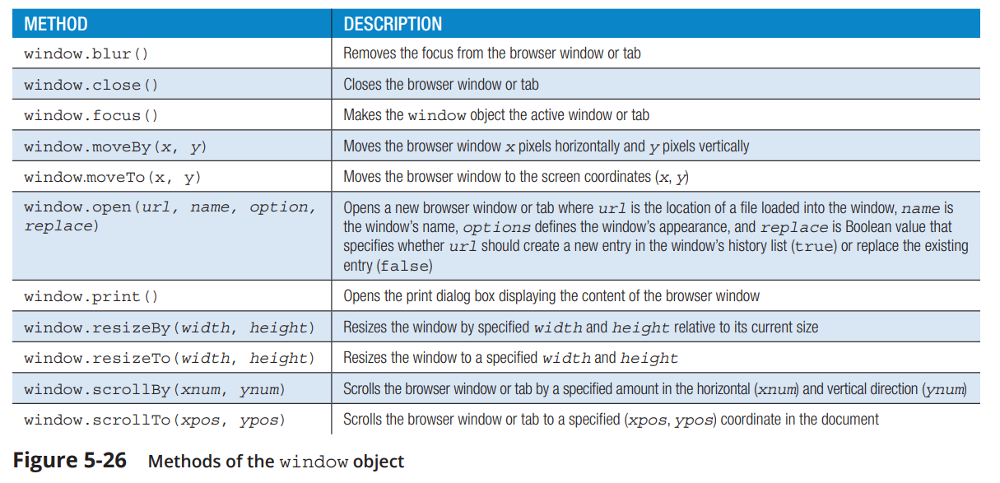

# 5 - Creating a Web App Using the Document Object Model

## Introduccing Nodes

### Nodes and the Document Object Model

Each element, attribute, comment, processing instruction, or text string within a web document is a distinct entity known as a **node**.

In the Document Object Model, nodes are organized into a hierarchical structure called a node tree. _Figure 5-4_ shows the representation of the node tree for a sample HTML file.


Nodes in the node tree have a familial relationship—each node can be a parent, child, and/or sibling of other nodes. 
In the node tree shown in _Figure 5-4_, the parent of the `body` node is the html node, and the parent node at the top of the node tree is known as the `root node`. The `body` element has two child nodes: an `h1` element and a paragraph (p) element. The `h1` element and the `paragraph` element are siblings of each other because they share a common parent. 

> :memo: **Nota:** The root node can be referenced using the _documentElement_ object. The page body itself can be referenced using the document.body object.

Each of these familial relationships can be referenced using the JavaScript properties shown in _Figure 5-5_.


To go two levels up (to the “grandparent”) add another parentNode property to the expression:

```javascript
node.parentNode.parentNode
```
and to go to an “aunt or uncle” node, go up to the parent node and move to either sibling:

```javascript
node.parentNode.previousSibing
node.parentNode.nextSibling 
```
By combining the properties listed in _Figure 5-5_, you can start from any node in the node tree and navigate to any other node. Nodes can also be referenced as part of collection within a node list. The following childNodes property references a collection of all nodes that are children of the node object:

```javascript
node.childNodes
```
As with arrays and HTML collections, a node list is indexed starting with an index of 0 and the total number of nodes within the list indicated by the length property. Both of the following expressions reference the first child node of its parent:

```javascript
node.firstChild
node.childNodes[0]
```

The properties in _Figure 5-5_ make no distinction between nodes that represent elements and nodes that represent text strings, comments, and other types of nodes in the node tree. Most applications are concerned only with *element nodes*. To work directly with those, JavaScript provides the properties listed in _Figure 5-6_.


One of the reasons to use nodes to create page content instead of using a property like innerHTML is that nodes provide the ability to create, add, remove, and rearrange elements within the node tree, giving the programmer control over not just the content of the web document but also its structure.

> :warning: ***Common Mistakes:*** Referencing **Child Elements**
In some scripts you might need to reference the children of a parent node. Make sure you reference the right node list. To reference only element nodes, use the children property. To reference nodes of any kind, use the childNodes property. 

### Selecting Nodes with the `querySelectorAll()` Method

You can define a node list based on a CSS query using the following querySelectorAll() method:

```javascript
document.querySelectorAll(css) 
```

where `css` is the text of CSS selector. For example, the following expression creates a node list by selecting all paragraph element nodes belonging to the review class:

```javascript
document.querySelectorAll("p.review"); 
```

However, the querySelectorAll() method creates a node list, not an HTML collection, and there are some important differences. JavaScript also provides the `querySelector()` method, which returns the first element node that matches the CSS selector rather than the complete node list.

> **Node Lists vs. HTML Collections**
1. Items within an HTML collection can be referenced by index number, element id, or element name. Items within a node list can only be referenced by their index number. 
2. HTML collections can only contain elements. A node list can contain a variety of 
node types including elements, text strings, and attributes.
3. HTML collections are dynamic so that changes in the structure of the web page will be automatically reflected in the HTML collection. A node list is static. Once it has been created it will not automatically update itself even as the document changes.

### Creating and Connecting Nodes

Like objects and variables, nodes can be created using JavaScript and stored as variables. The methods employed by JavaScript to create or copy nodes are described in _Figure 5-7_.


For example, the following code creates an element node for an h1 heading and a text node containing the text string “My Slideshow”:

```javascript
let mainHeading = document.createElement("h1");
let headingTxt = document.createTextNode("My Slideshow");
```

Nodes can be combined to create a **document fragment**. The document fragment resides only within computer memory and is not yet part of the web page. _Figure 5-8_ describes the JavaScript methods used to combine, replace, or remove nodes. 


The following code appends the `headingTxt` node as a child of the `mainHeading` node:

```javascript
mainHeading.appendChild(headingTxt); 
```
resulting in the following document fragment:

```html
<h1>My Slideshow</h1> 
```

To place `mainHeading` into the web document it must be attached to a node already present in that document’s node tree. If the document had a div element with the id “intro”, the `mainHeading` node could be attached to that element using the following code:

```javascript
let introDIV = document.getElementById("intro");
introDiv.appendChild(mainHeading); 
```

and the web page would then include the following content:

```html
<div id="intro">
    <h1>My Slideshow</h1>
</div> 
```

Proceeding in this fashion, you can continue to append nodes to each other and to elements within the web page, creating an elaborate hierarchy of parent and child elements.

### Elements Nodes and HTML Attributes

- Attributes are considered nodes.
- it is often easier to enter the attribute and its value directly as a property of a node.
-  Every HTML attribute has a corresponding **node property.**
    - For example, the following code attaches the id property with the value “main” to the `mainHeading` node created previously:
        ```javascript
        mainHeading.id = "main";
        ```
        resulting in the following HTML content:

        ```html
        <div id="intro">
          <h1 id="main">My Slideshow</h1>
        </div>
        ```
- In the same way, 
    - you can use the **src** property to add a _src attribute_ to the element node for an inline image or 
    - the **href** property to define the _href attribute_ for the `<a>` tag. 
- One exception to this approach is HTML’s _class attribute_. Because class is a reserved JavaScript keyword, it cannot be used as a property of an element node. Instead, JavaScript uses the **className property** as in the following example that sets a value for the class attribute of the mainHeading element node:

    ```javascript
    mainHeading.className = "lightbox";
    ```
    resulting in the following modification to the `<h1>` tag:

    ```html
    <div id="intro">
        <h1 id="main" class="lightbox">My Slideshow</h1>
    </div>
    ``` 

The **classList property**, which is used with HTML elements associated with more than one class. With the **classList** property you can add, remove, or replace class values from an element with multiple classes.

### Nodes and Inline Styles

Inline styles are added to HTML elements using the style attribute. Thus, the following HTML code

```html
<h1 id="main" style="font-size: 1.5em; color: blue">
    My Slideshow
</h1> 
```

can be replaced with the JavaScript statements:

```javascript
let mainH1 = document.getElementById("main");
mainH1.style = "font-size: 1.5em; color: blue;"; 
```

However, you can also define individual styles by appending the style property and a style value to the object. For example, you can set values of the font-size and color properties using the following:

```javascript
mainH1.style.fontSize = "1.5em";
mainH1.style.color = "blue"; 
```

> :warning: **Notice** that because JavaScript does not support hyphens in property names, the CSS font-size style is written in camel case as fontSize. Similarly, the background-color style would be written as backgroundColor, the font-family style would be entered as fontFamily, and so forth. 

> **Any styles defined using the style property are treated as inline styles and thus will have precedence over styles defined in an embedded or external style sheet.**

## Restructuring a Node Tree

### Moving Nodes with the `appendChild()` Method

The method appends the node, placing it at the end of the child list. If the node is already part of a document tree, the `appendChild()` method moves the node from its current location to that new position. 

- Thus, the following statement:

```javascript
lbImages.appendChild(lbImages.firstElementChild); 
```
moves the first image, referenced with the expression `lbImages.firstElementChild` to the end of the list of images. All the other images will move up in position so that the second image is now the first, the third image is now the second, and so forth.

### Moving Nodes with the `insertBefore()` Method

To insert a node at any position other than the end of the list of child nodes, apply the following **insertBefore()** method:

```javascript
node.insertBefore(new, child)
```

where `node` is the parent node, `new` is the node that will be inserted as a new child of the parent, and `child` is a child node before which the new node is to be placed. As with the `appendChild()` method, if the new node is already part of the node tree it will be moved from its current location to its new location.

### Cloning a Node

In some of your applications you may need to create and move a copy of a node rather than the node itself. To create a node copy, apply the command:

```javascript
node.cloneNode(deep)
```

where `node` is the node to be copied and `deep` is a Boolean value that is true to create a deep copy that copies the node and all of its descendants or false to copy only the node and not any descendants. 

- In the following code, the `mainCopy` node is a copy of all the content of the `mainElem` node, including any nested headings, paragraphs, text, inline image tags, etc. 

```javascript
let mainElem = document.getElementById("main");
let mainCopy = mainElem.cloneNode(true);
```

The `cloneNode()` method will copy all of the node’s DOM content, but it will not copy any JavaScript properties attached to the node. For example, it will not copy event handlers, so those will have to added individually to any node copies.

## Running Timed Commands

### Repeating Commands at Specified Intervals

A **timed command** is a command or function that is run at a specified time or repeated at set intervals. To repeat a command at set intervals, apply the following `setInterval()` method: 

```javascript
timeVar = window.setInterval(command, interval) 
```

where `timeVar` is a variable that stores an id identifying the timed command, `command` is a statement or command that will be repeatedly run, and `interval` is the interval in milliseconds between runs. 
- For example, the following statement runs the `moveNext()` function every 2000 milliseconds (2 seconds) after an initial 2-second delay. The id of the timed command is stored in the timeID variable.

    ```javascript
    let timeID = window.setInterval(moveNext, 2000);
    ```

    > :note: To run a timed command with no initial delay, include two statements: the first statement running the command immediately and a second statement using the setInterval() method to run the command 
after a specified time interval.

### Stopping a Timed Command

Once a timed command is initiated, it can be stopped using the following `clearInterval()` method:

```javascript
window.clearInterval(timeVar)
```

where `timeVar` is the variable storing the id of the timed command. An application might have several timed commands running simultaneously, so the id is necessary to distinguish one timed command from another.

### Using Time-Delayed Commands

Another type of timed command is one in which the command is ***run once after a specified delay***. To run a delayed command use the following `setTimeout()` method: 

```javascript
let timeVar = window.setTimeout(command, delay); 
```

where `delay` is the delay time in milliseconds. 
- The following command runs the `showNext()` function but only after 
a 2-second delay. 

    ```javascript
    let timeID = window.setTimeout(showNext, 2000);
    ```

As with the `setInterval()` method, time-delayed commands can be assigned an id that distinguishes the command from other timed commands. To prevent a delayed command from running, apply the following `clearTimeout()` method: 

```javascript
window.clearTimeout(timeVar)
```

Once a time-delayed command runs or is cleared, it is removed from the queue and will not run unless another setTimeout() method is applied to place it back in the queue.

> :memo: With all properties and methods of the window object, you can omit the window part of the reference name, for example, using `setInterval()` in place of `window.setInterval()`. You can use the window part of the reference to apply the property or method to a specific browser window in the case of a script that involves working with multiple open windows.

## Working with Popup Windows

### System Dialog Boxes

One popup window that you’ve already seen is the alert window created with the `window.alert()` method. The alert window simply displays a message along with an OK button to close the window, but the method does not ask for any response from the user. 

A window that does provide the ability for the user to respond is a confirmation window that displays a message along with an **OK** and **Cancel** button. The window returns a value of _true_ or _false_ depending on whether the user closed the window by clicking the OK button or the Cancel button. To create a confirmation window, apply the following window.confirm() method:

```javascript
response = window.confirm(message)
```

where `response` is a Boolean value that is true if the user clicks the OK button and false if the user clicks the Cancel button, and `message` is the text that appears in the window.

For a more general response, JavaScript provides the prompt window that displays a message along with an input box into which the user can enter a text string. To create a prompt window, apply the following `window.prompt()` method:

```javascript
response = window.prompt(message, default)
```

where `response` is the text of the user’s response, `message` is the prompt message, and `default` is the input box’s default value.

### Working with Browser Windows

Another approach to creating a popup window is to open a new browser window. The browser window then becomes its own window object with its own collection of properties and methods. You can use JavaScript to create a new window object and define the window’s appearance and content. **Figure 5-25** describes some of the JavaScript properties associated with the window object. 


**Figure 5-26** describes some of the methods that can be applied to the window object.



To create a new browser window, apply the following `window.open()` method:

```javascript
window.open(url, title, options, replace) 
```

where `url` is the location of the file displayed in the window, `title` is the window’s title, `options` is a comma separated list of features defining the window’s appearance, and `replace` is an optional Boolean value that specifies whether url should create a new entry in the window’s history list (true) or replace the existing entry (false). You 
can include all or none of the arguments for the `window.open()` method. 

Depending on the arguments used with the window.open() method, the new content might open as a popup window or it might appear as a new tab within the browser. 
- For example, the statement `window.open("http://www.example.com");` 
opens the page at www.example.com in a new browser window or tab. If you exclude a url value or specify and empty text string, a blank browser window or tab opens.

You can customize the appearance of a new browser window or tab using the options argument in the `window.open()` method. **Figure 5-27** lists options common to all major browsers. Because the window object is part of the ***Browser Object Model***, the exact list of features is determined by the browser. Some browsers also include the ability to turn off the address bar or allow the window to be resized; others do not.


If you omit an option list in the `window.open()` method, then all standard options are included in the new browser window. However, if the window.open() method does include an option list, only those features specified in that list will be applied to the new window or tab. To force the browser to display a new browser window rather than a new 
tab, always include a **width** and **height** value in the option list of the `window.open()` method.

The following statement creates a browser window that is 400 pixels wide by 600 pixels tall displaying the contents of the page at www.example.com without a toolbar, menu bar, location box, or status bar.

```javascript
let newWin = window.open("http://www.example.com", "win", "width=400, height=600, toolbar=0, menubar=0, scrollbars=0, status=0"); 
```

The window is stored in an object variable named `newWin`. When a window has been saved under a variable name, you can apply the properties and methods described in **Figures 5-25** and **5-26** to it. 
- For example, the following statement 
moves the newWin browser window to a position 300 pixels to left and 400 pixels down from the top-left corner of the screen and then increases its width and height by 50 pixels. 

    ```javascript
    newWin.moveTo(300,400);
    newWin.resizeBy(50, 50);
    ```

Values for moving, sizing, or scrolling browser windows are always measured in pixels. You do not have to include the px unit, only the value itself.

> :memo: You can reference the window from which the popup window was opened using the opener property. The expression `newWin.opener` would refer to the original window that opened the newWin popup. In this way, the two windows can exchange information and content.

### Writing Content to a Browser Window

The new window contains a web document and thus all document properties and methods can be applied to that document. The document body contained within the window is referenced using the `window.document.body` object 
where `window` is the name assigned to the window object. 

- Thus, the following code creates a blank window named newWin and adds the `h1` heading `<h1>My slideshow</h1>` to the document body. 

    ```javascript
    let newWin = window.open("", "slideshow", "width=500, height=300");
    let mainHeading = document.createElement("h1");
    mainHeading.textContent = "My Slideshow";
    newWin.document.body.appendChild(mainHeading);
    ```

- You can also use the document.write() method to write the content into the document as a single text string:

    ```javascript
    let newWin = window.open("", "slideshow", "width=500, height=300");
    newWin.document.write("<h1>My Slideshow</h1>"); 
    ```

## Creating an Overlay

An alternative to a popup window is an `overlay`, which is an element that lays on top of the rest of the page content, partially obscuring that content. An overlay is sometimes referred to as a modal or modal window, a window that takes control of an application and must be closed before the user can continue using the app.

The image overlay will contain the following HTML code:
```html
<div id="lbOverlay">
    <figure>
        
        <figcaption>text</figcaption>
    </figure>
    <div id="lbOverlayClose">&times;</div>
</div>
```
where `url` is the URL of the clicked image and `text` is the caption text associated with that image. The styles for the overlay have already been entered into the lightbox.css stylesheet, using the following style rules: 

```css
div#lbOverlay {
   position: fixed;
   top: 0;
   left: 0;
   z-index: 1;
   width: 100%;
   height: 100%;
   background-color: rgba(104, 49, 0, 0.85);
}
```

The style rule fixes the div element within the browser window and sizes it to cover the complete window. A semitransparent browser background is used so that the contents of the page are still partially visible beneath the over.

### Introducing the `this` Object

The `this` object references the owner of a currently running segment of JavaScript code. That general definition can be confusing because its meaning depends on context. How do you determine who “owns” the code? For an anonymous function called by an event handler or event listener, the owner of the function is the object that initiated the event. 
**If clicking an image initiated an event that called an anonymous function, that image is the called function’s owner.**

### Removing a Node

To remove a node, apply the method:

```javascript
node.removeChild(old) 
```

where `node` is the parent node and `old` is the child node that will be removed from the parent.

## Exploring the Browser Object Model

In this section you will review some of the objects, properties, and methods associated with the **Browser Object Model (BOM)**. Like objects in the Document Object Model, objects in the BOM are also arranged in a hierarchy with the browser window at the top of the tree. See **Figure 5-33.**


The browser automatically creates the window object and the other objects in tree. The window object is also referred to as a **global object** because all other objects in the BOM are contained within it.

### The History Object

Each browser window maintains a history of all the pages that have been opened during the current session within a history list. Under the BOM, this information is stored in the `history` object. For security and privacy reasons, the `history` object does not store the actual contents or addresses of those pages, but you can go back and forth through 
the history list using the `back()`, `forward()`, and `go()` methods described in **Figure 5-34.**


- For example, to go back one page in the history list, apply either of the following statements:

    ```javascript
    window.history.back();
    window.history.go(-1);
    ```

- To go forward one page, apply either command: 

    ```javascript
    window.history.forward();
    window.history.go(1); 
    ```

These navigation methods are often used for applications that involve data entry in web forms spread across multiple pages. By applying these methods, users can go back or forward through the pages to review or revise their answers.  
To navigate through the history list of a popup window, use the name assigned to the window object as part of the history statement.

> :memo: **Note** The total number of pages stored in the history list is provided by the `window.history.length` property. 

### The location Object

Information about the current page opened in the browser is stored in the location object. Properties and methods of the location object are described in **Figure 5-35.**


The location object is a property of both the `document` and `window` objects, so you can write the entire reference as either `document.location` or `window.location`. If you omit the document or window object, the location is assumed to refer to the current document being viewed in the currently active window. 

The location object is useful for apps that must load certain web pages or extract important information from page addresses.

- For example, following statement uses the location object to load the Google home page into a popup browser window named newWin. 

    ```javascript
    let newWin = window.open("", "searchbox", "width=700, height=700"); 
    newWin.location.href = "http://www.google.com";
    ```

- You can also load the Google home page using either of the following statements:

    ```javascript
    location.assign("http://www.google.com");
    location.replace("http://www.google.com");
    ```

The difference is that `replace()` method removes the URL of the current page, so that the user won’t be able to use the back button to navigate back to the original document.

### The navigator Object

The navigator object is used to obtain information about the user’s browser. Different browsers support different properties, but the properties described in **Figure 5-36** are supported by all current versions of the major browsers.  
The navigator object is primarily used for debugging or for verifying that the user is running a compatible browser or operating system.


### The screen Object

Computer displays vary widely depending on the type of device, the size and resolution of the monitor, the features of the graphics card and screen settings chosen by the user. Information about the screen is stored in the `screen` object. **Figure 5-37** describes the properties associated with the object.


If your app employs popup windows, you can use the `width` and `height` properties of the `screen` object to center the popup within the screen. To center a popup window, subtract the width and height of the popup from the screen’s width and height and divide those differences by two. Assign the two calculated values to the popup window’s left and top position. 

- The following code show a function that opens a popup window centered on the screen for a given width and height value: 

    ```javascript
    function centerPopup(url, popName, popWidth, popHeight) {
       let leftPos = (screen.width - popWidth)/2;
       let topPos = (screen.height - popHeight)/2;
       let popOptions = "width="+popWidth + ", height=" + popHeight + 
       ", left=" + leftPos + ", top=" + topPos;
       let popWin = window.open(url, popName, popOptions); 
    } 
    ```
    